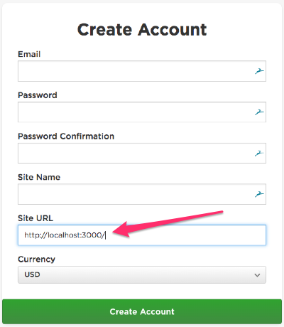
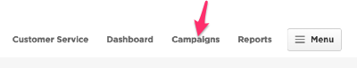
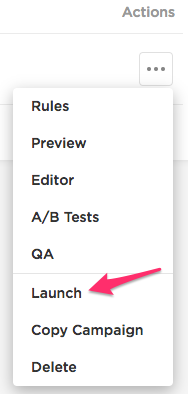
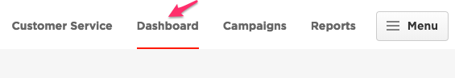
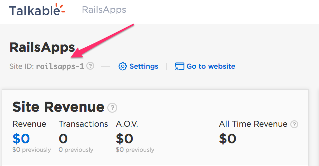
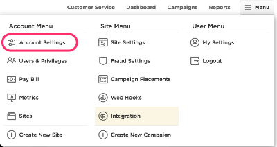
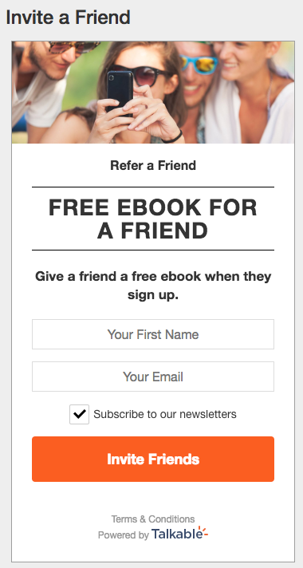
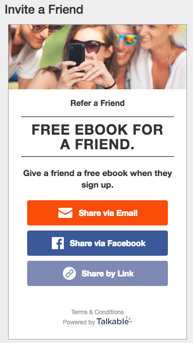
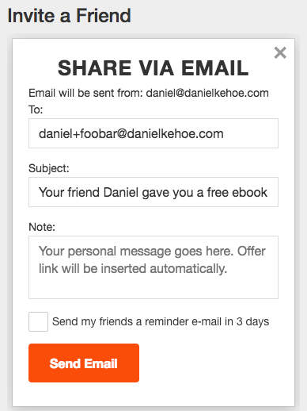
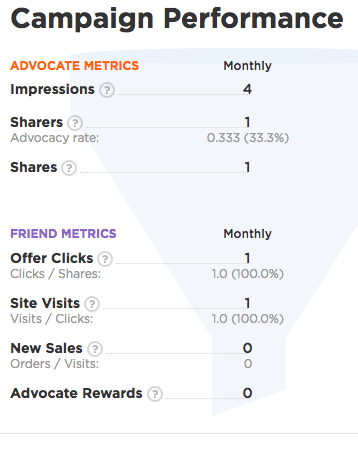

# Referral Marketing with the Talkable Gem

## Introduction

You may read the [first tutorial](https://railsapps.github.io/talkable-referral-marketing-basics/) to grasp the basic concepts you'll need to know to use the Talkable platform. This tutorial shows how to build an application with the same functionality as the first tutorial application, but instead of using the JavaScript integration library you'll use the Ruby gem and the Talkable API.

## Requirements

Ruby 2.6+ and Rails 6.0+ (if you're using Rails).

## Create an Account

First [create a Talkable account](https://admin.talkable.com/register?self_serve).
When asked to choose a platform, choose "Other" for plain Rails integration. In order to be able to develop and test the application locally set the Site URL to `http://localhost:3000/`.

**An example campaign is created automatically for you.**

## Launch the Campaign

You are done with the Talkable administrative interface for now and can launch your example campaign, even though your web application isn't ready yet.

Select "Campaigns" from the top navigation bar.

"Launch" is hidden behind three dots under the "Action" label.

Ignore any warnings, accept the defaults, and click the orange "Launch campaign" button.

You'll see a warning, "No Integration Found." Ignore the warning. Talkable checks if an Integration script is present on a production site but our development site is not running or accessible to Talkable. Click the green "Launch Now" button.

Your campaign will be live and waiting for events triggered by advocates (recommendations) or friends (claiming rewards). All events generated by the Talkable JavaScript integration library will be tracked and captured by Talkable for analysis and optimization.

Next, we will set up the tutorial application to use the Talkable campaign. After that, we can return to the Talkable site to see reports of all activity.

## Install the Talkable Ruby Gem

You can use the [Talkable Ruby Gem](https://github.com/talkable/talkable-ruby) to add a referral program to any Ruby application.

Add the gem to the project *Gemfile* and run `bundle install`.

`gem 'talkable'`

## Get Your Site Slug and API Key

The Talkable gem provides a Rails generator for basic configuration of the gem.

### Site Slug

You can easily find the "site slug." You'll see the Dashboard page when you log in. The site slug is labelled "Site ID" in the upper left corner.

### API Key

You'll also need an API key. You can find the Account Settings page from the main menu.

You'll find the API Key under Basic Settings. You won't need the Public API Key (that's just for iOS or Android developers).

With your site slug and API key you are ready to run the generator.

## Run the Generator

Run the install generator from the terminal:

`$ rails generate talkable:install`

The generator will prompt you for your "site slug" and API key.

The generator will ask if you have a custom domain. You can answer, "no." Custom domains are an advanced feature for Talkable integration.

In order for example setup to work you'll need to run two more generators.

`$ rails generate talkable:invite_standalone`

Invite standalone generator will add a controller and a view where your campaign will be rendered.
The placement of where to render the campaign is controlled in your campaign settings on Talkable site.
For the example campaign we chose to use `/invite` as our placement.

`$ rails generate talkable:example_newsletter_signup`

Example newsletter signup will add a controller, routes and views to your app.
Our example campaign is configured in a way that will redirect the `friend` to `/example_newsletter_signup` after the claim. On that page a user will be prompted to fake email signup. By default this `signup` only sends a corresponding event via Talkable API.

We encourage you to inspect all the stuff produced by generators up close (this section is more detailed in the original ruby gem tutorial).
Here are a few important details.

The file *app/views/invite/show.html.erb* renders the view. It contains a reference to the view partial in the file *shared/talkable_offer*.

Your Invite page will display a Talkable referral offer in an iframe, if the following conditions are met:

* The Talkable initialization script is in place
* A Talkable Invite Standalone campaign exists
* A Talkable Campaign Placement specifies the `http://localhost:3000/invite` URL
* The Invite page contains `

`

We'll use the Invite page to display a referral offer from the Invite Standalone campaign. You can add links to this page anywhere in your application where you want to encourage visitors to refer a friend.

It is important to set a User ID or other unchanging string as an `event_number` each time the page is requested by a visitor. With an unchanging User ID, Talkable will recognize the page requests as repeat visits by the same visitor and will record the visits accordingly.

We add the integer 100 to the `current_user.id` to create an `event_number` just for the purpose of this tutorial. If you implemented the tutorial application in our [first tutorial](https://railsapps.github.io/talkable-referral-marketing-basics/), you may have already recorded events for the Invite Standalone campaign. If you build a new application and sign up using event numbers that are already recorded, the Talkable API will respond with an error message "Talkable::API::BadRequest." Adding 100 helps us avoid the issue for anyone who tried the application in the first tutorial.

That's all the code we need for our simple refer-a-friend feature. We can try out the tutorial application. But first, let's review the fundamental concept of the *referral loop*.

## Understanding The Referral Loop

It's helpful to understand the *referral loop* to grasp the principles of referral marketing. In its most basic form, as we've used it here:

* An advocate opens the referral loop by clicking the referral offer on the Invite page and sending a recommendation to a friend.

* A friend receives the recommendation and clicks a link on a "claim page"; a cookie is set by Talkable.

* The friend gets redirected to the site. On any page they visit, Talkable will recognize the friend's visit by the presence of the cookie.

* The friend signs up for an example newsletter (a *conversion event*) and the API request signals Talkable, closing the referral loop.

Building on this simple referral loop, you can develop more sophisticated referral marketing campaigns. For example, you can add incentives for the friend or advocate. For a product sales site, you could offer a discount coupon, a rebate, or a non-monetary incentive such as stickers or a t-shirt. You can track an advocate's multiple referrals or even chains of referrals among friends. Talkable supports almost any referral marketing program you can imagine.

Now let's try out the tutorial application.

## Time to test how it all works

Make sure your campaign is launched. Now go to `http://localhost:3000/invite`

### Advocate Invites a Friend

You should now see our campaign page for the Advocate.

Enter your name and email address in the form and click "Invite Friends".

The Advocate Share offer will appear on the Invite page.

Below you can find the scenario when you share the offer via email. Alternatively you can share via `Copy a Link`. You copy the link and open it in another browser or in the incognito mode. You should be able to claim your reward right away.

Click "Share via Email" and fill in the form with a friend's email address. To try out the application, you should enter your own alternative email address. If you use Gmail, you can use the Gmail "plus" trick to create alternative addresses that will be delivered in your inbox. For example, add a "+foobar" to use "yourname+foobar@gmail.com". This will open a referral loop by registering your email address as an advocate and the friend's email address as a pending invitation.

You are done with the Invite page. Sign out of the application so you can pretend to be the friend next time you visit the web application.

### Friend Receives Email

Check your email inbox. Less than a minute after submitting the form with the friend email address, you should receive an email message from Talkable. There will be a prominent "Claim Your Gift" button in the message body. The claim button is a link to the Talkable server that will track the action and redirect to your web application.

### Friend Clicks Link

Click the "Claim Your Gift" button in the email message and you will visit the newsletter signup page of your application.

### Friend Signs Up

Now sign up for an example newsletter.

You'll see the Thank You page. Behind the scenes, the Talkable controller will make an API request to Talkable to record the signup event. This closes a referral loop because Talkable recognizes the friend's email address from the advocate's invitation.

Next let's view reports on the Talkable site and see the events that Talkable has recorded.

## Talkable Reports

Sign in to the Talkable site and select "Reports" from the top navigation bar.

View some of the reports under the "Support" heading.

The **People** report will show the email addresses of the advocates and friends.

The **Events** report will show the signup activities.

The **Advocate Offers** report will show the email address of each advocate and the name of the campaign to which each responded.

The **Offer Shares** report will show the linked advocates and friends.

The **Referrals** report will show the complete details of each referral event. If any event indicates "Campaign doesn't offer Self-Referral Incentive," you will need to check the Fraud Settings from the main menu. You can adjust the Fraud Settings to allow self-referrals for the purpose of testing.

Take a few minutes to view the reports and see how the referral activity is logged for analysis and action. If Talkable was integrated correctly in your application, all the referral activity should be reflected in the reports.

## Campaign Performance

Finally, to see a high-level analysis of your referral marketing campaign, find the Campaign Performance summary. Select "Campaigns" from the top navigation bar.

Click the "Invite Standalone" campaign to see a campaign summary.

The Campaign Performance summary shows the funnel of impressions (page visits), advocates (sharers), sharing events, and visits by friends. The Campaign Performance isn't the end point of a typical referral marketing campaign. It is the beginning point for further testing and optimization to refine a referral marketing campaign.

With this introduction to referral marketing and the Talkable platform, you've seen the basics of referral marketing.

The functionality of the tutorial application is minimal but you’ve learned enough to add simple referral marketing to any Rails application.

## Troubleshooting

Troubleshooting options are limited with the Ruby gem.

### Verification Query

In the [first tutorial](https://railsapps.github.io/talkable-referral-marketing-basics/), we were able to use a verification query to check that the Talkable initialization script is connecting to the Talkable server and recognizing your account. For example:

* [http://localhost:3000/?tkbl_verify_integration=true](http://localhost:3000/?tkbl_verify_integration=true)

However, this verification query doesn't work with the Ruby gem.

## Support

Was this tutorial helpful? For questions or more information, contact <a href="mailto:support@talkable.com">support@talkable.com</a>.
